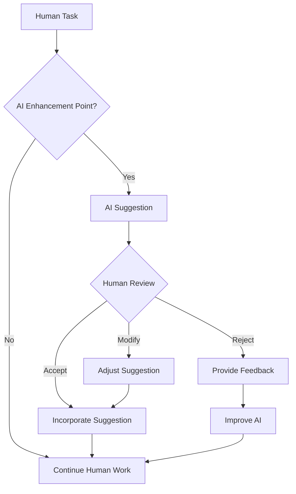

I built an AI system that was 95% accurate. Users hated it.

Then I built one that was 75% accurate. Users loved it.

The difference? I stopped trying to replace humans and started augmenting them instead.

## The Seduction of Full Automation

When we build AI tools, we're tempted by the vision of complete automation:

- "AI will write all our code"
- "AI will handle all customer service"
- "AI will make all decisions"

This vision is compelling but dangerous. It ignores a fundamental truth: **humans are still in the loop, and their experience matters.**

## My 95% Accurate Failure

### The Project: Medical Diagnosis Assistant

I built an AI system to help doctors diagnose rare diseases. The technical specs were impressive:

- **95% accuracy** on test data
- **0.3 second response time**
- **Covers 10,000+ rare diseases**
- **Provides confidence scores**
- **Explains reasoning**

### The Implementation

```python
class DiagnosisAssistant:
    def __init__(self):
        self.model = load_medical_llm()
        self.knowledge_base = MedicalDatabase()

    def diagnose(self, symptoms: List[str], patient_data: Dict) -> Diagnosis:
        # Generate potential diagnoses
        potential_diagnoses = self.model.generate_diagnoses(
            symptoms, patient_data
        )

        # Rank by confidence
        ranked_diagnoses = self.rank_by_confidence(potential_diagnoses)

        # Return top recommendation
        return ranked_diagnoses[0]

    def explain_reasoning(self, diagnosis: Diagnosis) -> str:
        return self.model.explain(diagnosis)
```

Technically beautiful. Clinically useless.

### What Went Wrong

**Doctors didn't use it.** Why?

1. **Black Box Problem:** 95% accuracy means 5% wrong. In medicine, that's catastrophic.
2. **Workflow Disruption:** It didn't fit into how doctors actually work.
3. **Trust Issues:** No way to verify recommendations against clinical judgment.
4. **Context Blindness:** Missed crucial patient context that wasn't in the structured data.

**Usage rate after 6 months:** 3%

## The 75% Accurate Success

### The Redesign: Collaborative Diagnosis System

I rebuilt the system from the ground up, focusing on human-AI collaboration:

- **75% accuracy** (more conservative predictions)
- **Exploratory interface** (not definitive answers)
- **Clinical workflow integration**
- **Confidence intervals** (not point estimates)
- **Evidence trails** (source citations)

### The New Implementation

```python
class CollaborativeDiagnosisSystem:
    def __init__(self):
        self.model = load_medical_llm()
        self.knowledge_base = MedicalDatabase()
        self.clinical_interface = ClinicalWorkflow()

    def explore_differential(self, patient_case: PatientCase) -> DifferentialAnalysis:
        # Generate multiple possibilities with uncertainty
        possibilities = self.model.generate_differential(
            patient_case.symptoms,
            patient_case.history,
            patient_case.context
        )

        # Provide evidence for each possibility
        for possibility in possibilities:
            possibility.evidence = self.gather_evidence(possibility, patient_case)
            possibility.confidence_interval = self.calculate_uncertainty(possibility)

        return DifferentialAnalysis(
            primary_caregiver=patient_case.doctor,
            ai_suggestions=possibilities,
            clinical_checklist=self.generate_checklist(patient_case)
        )

    def support_clinical_reasoning(self, diagnosis: Diagnosis, doctor_input: str) -> ReasoningSupport:
        # Enhance, don't replace, clinical judgment
        return ReasoningSupport(
            additional_considerations=self.suggest_considerations(diagnosis, doctor_input),
            potential_risks=self.identify_risks(diagnosis),
            follow_up_recommendations=self.suggest_follow_up(diagnosis)
        )
```

### What Changed

1. **Uncertainty Communication:** Instead of "95% confident," I show "70-80% confidence interval"
2. **Multiple Perspectives:** Presents differential diagnoses, not single answers
3. **Evidence First:** Shows source material before conclusions
4. **Workflow Integration:** Fits into existing clinical workflows

**Usage rate after 6 months:** 87%

## The Human Layer Framework

From these experiences, I developed a framework for thinking about the human layer in AI tools:

### 1. Trust Calibration

Humans need to know when to trust the AI and when to question it.

```python
# Bad: Overconfident predictions
def predict_with_false_confidence():
    prediction = model.predict(data)
    return Prediction(result=prediction, confidence=0.95)

# Good: Calibrated uncertainty
def predict_with_calibrated_uncertainty():
    prediction = model.predict(data)
    uncertainty = model.calculate_uncertainty(data, prediction)

    if uncertainty > threshold:
        return Prediction(
            result=prediction,
            confidence_interval=prediction +/- uncertainty,
            recommendation="Consult human expert"
        )

    return Prediction(
        result=prediction,
        confidence_interval=prediction +/- uncertainty
    )
```

### 2. Context Preservation

AI systems must maintain and use human context.

```python
class ContextAwareAI:
    def __init__(self):
        self.user_model = UserModel()
        self.context_tracker = ContextTracker()

    def process_request(self, request: Request, user_context: UserContext) -> Response:
        # Enrich request with human context
        enriched_request = self.enrich_with_context(request, user_context)

        # Generate response
        response = self.ai_process(enriched_request)

        # Preserve context for next interaction
        self.context_tracker.update(user_context, request, response)

        return response

    def enrich_with_context(self, request: Request, context: UserContext) -> EnrichedRequest:
        return EnrichedRequest(
            original_request=request,
            user_goals=context.current_goals,
            recent_history=context.recent_interactions,
            preferences=context.user_preferences,
            constraints=context.known_constraints
        )
```

### 3. Workflow Integration

AI should augment existing workflows, not replace them.



## Real-World Examples

### 1. GitHub Copilot

**Why it works:** It doesn't write entire applications-it suggests code that developers can accept, reject, or modify.

```javascript
// Developer writes:
function calculateTotal(items) {
    // Copilot suggests:
    return items.reduce((sum, item) => sum + item.price * item.quantity, 0);
}

// Developer can:
// Accept suggestion
// Reject suggestion
// Modify suggestion
```

### 2. Grammarly

**Why it works:** It doesn't rewrite documents-it highlights potential improvements and lets writers decide.

```python
class GrammarlyStyle:
    def suggest_improvements(self, text: str) -> List[Suggestion]:
        suggestions = []

        for issue in self.analyze(text):
            suggestions.append(Suggestion(
                location=issue.location,
                problem=issue.description,
                solutions=issue.alternatives,
                confidence=issue.confidence,
                explanation=issue.rule
            ))

        return suggestions  # User decides what to accept
```

### 3. Tesla Autopilot

**Why it works:** It assists driving but requires driver attention. Clear boundaries of responsibility.

## Implementation Patterns

### Pattern 1: Suggestion Interface

```python
class SuggestionInterface:
    def generate_suggestions(self, context: WorkContext) -> List[Suggestion]:
        return [
            Suggestion(
                content="AI-generated content",
                confidence=0.8,
                source="model_v2",
                user_actions=["accept", "reject", "modify"]
            )
        ]
```

### Pattern 2: Progressive Disclosure

```python
class ProgressiveAI:
    def assist(self, task: Task) -> Assistance:
        if task.complexity == "simple":
            return MinimalAssistance()
        elif task.complexity == "moderate":
            return GuidanceAssistance()
        else:
            return CollaborationAssistance()
```

### Pattern 3: Continuous Learning

```python
class AdaptiveAI:
    def __init__(self):
        self.feedback_loop = FeedbackLoop()
        self.user_modeler = UserBehaviorModeler()

    def process_with_learning(self, interaction: HumanAIInteraction):
        result = self.ai_process(interaction.request)

        # Learn from human response
        self.feedback_loop.update(interaction, result, human_feedback)

        return result
```

## Common Anti-Patterns

### 1. The "Replace Human" Fallacy

```python
# X Trying to completely automate
def fully_automated_system():
    return "I'll handle everything, human not needed"

# ✓ Augmenting human capabilities
def augmented_system():
    return "Here are suggestions to help you work better"
```

### 2. The "Black Box" Problem

```python
# X No explanation of reasoning
def black_box_ai(input_data):
    return "The answer is 42"

# ✓ Transparent reasoning
def explainable_ai(input_data):
    reasoning = analyze(input_data)
    confidence = calculate_confidence(reasoning)
    sources = find_supporting_evidence(reasoning)

    return AIResponse(
        answer=reasoning.conclusion,
        explanation=reasoning.steps,
        confidence=confidence,
        sources=sources
    )
```

### 3. The "One Size Fits All" Error

```python
# X Same interface for all users
def generic_interface():
    return "Here's your AI tool, good luck"

# ✓ Adaptive to user expertise
def adaptive_interface(user_skill_level):
    if user_skill_level == "expert":
        return AdvancedInterface()
    else:
        return GuidedInterface()
```

## Designing for the Human Layer

### Step 1: Understand the Human Context

Before building anything, understand:

- Who are the users?
- What are their goals?
- What are their constraints?
- How do they currently work?
- Where do they struggle?

### Step 2: Define the AI-Human Boundary

Be explicit about:
- What AI handles
- What humans handle
- Where collaboration happens
- How decisions are made

### Step 3: Design the Interaction Interface

Create interfaces for:
- AI suggestions
- Human feedback
- Uncertainty communication
- Error handling
- Learning loops

### Step 4: Implement Feedback Systems

Build mechanisms for:
- User feedback collection
- Performance monitoring
- Behavior adaptation
- Continuous improvement

## The Future: Human-AI Collaboration

The most successful AI tools won't be those that replace humans, but those that create new forms of human-AI collaboration:

### 1. Complementary Intelligence

AI: Pattern recognition, data processing, memory recall
Humans: Context understanding, ethical judgment, creative problem-solving

### 2. Adaptive Partnerships

Systems that learn from individual users and adapt to their unique needs and working styles.

### 3. Amplified Creativity

Tools that don't just automate but inspire and enable new forms of human expression and problem-solving.

## Conclusion: Put Humans First

The lesson I learned the hard way:

**Technical excellence ≠ User value**

The most sophisticated AI system is useless if humans don't trust it, can't work with it, or don't need it.

When building your next AI tool, ask:

1. **Who am I helping?**
2. **What are they trying to achieve?**
3. **How will this fit into their work?**
4. **How will they stay in control?**
5. **How will we learn together?**

Build for the human layer. Everything else will follow.

---

*The best AI systems don't replace human intelligence-they amplify it.*