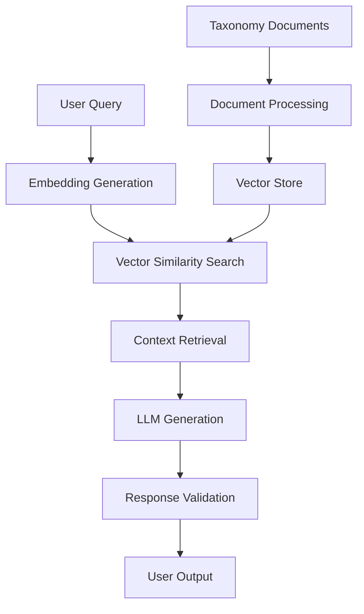

Three hours. That's how long it took small businesses to navigate the ONDC (Open Network for Digital Commerce) taxonomy to find the right category for their products. Today, that process takes seven seconds.

Here's how I built a retrieval-augmented generation (RAG) system that transformed catalog management for thousands of Indian businesses.

## The Problem: A Taxonomy Nightmare

The ONDC taxonomy isn't just complex-it's a labyrinth of nested categories, specific requirements, and evolving standards. For a small business owner selling handmade products, finding the right category feels like:

> "I have organic honey from Uttarakhand. Is it under 'Food Products > Honey > Organic' or 'Agricultural Products > Beekeeping > Natural Honey'? And what documentation do I need?"

**The pain points were massive:**
- 3,000+ product categories with 10+ levels of nesting
- Constantly evolving requirements and regulations
- Different compliance needs for different categories
- No search interface-only manual browsing

## Initial Approaches That Failed

### Attempt 1: Traditional Search
First try: Implement Elasticsearch with keyword matching.

```python
# Basic search approach
def search_products(query):
    results = elasticsearch.search(
        index="taxonomy",
        body={
            "query": {
                "multi_match": {
                    "query": query,
                    "fields": ["category_name", "description", "keywords"]
                }
            }
        }
    )
    return results
```

**Result:** 40% accuracy. Why? Semantic understanding was missing. "Organic honey" didn't match "Natural bee products" even though they're conceptually similar.

### Attempt 2: Classification Models
Next: Train a multi-label classifier to predict categories.

```python
# ML approach
from sklearn.multioutput import MultiLabelClassifier
from sklearn.feature_extraction.text import TfidfVectorizer

vectorizer = TfidfVectorizer(max_features=5000)
classifier = MultiLabelClassifier()

# Training on historical data
X = vectorizer.fit_transform(training_descriptions)
y = training_categories
classifier.fit(X, y)
```

**Result:** Better accuracy (65%), but still missed nuance and couldn't explain *why* a category was recommended.

## The Breakthrough: RAG Architecture

The insight came from realizing we needed both:
1. **Semantic understanding** of natural language queries
2. **Grounded responses** based on actual taxonomy documents

### Architecture Overview



## Implementation Deep Dive

### Step 1: Document Processing Pipeline

First, I needed to process the entire ONDC taxonomy into searchable chunks:

```python
import asyncio
from typing import List, Dict
from sentence_transformers import SentenceTransformer

class TaxonomyProcessor:
    def __init__(self):
        self.embedder = SentenceTransformer('all-MiniLM-L6-v2')
        self.chunk_size = 500  # Optimal for context window

    async def process_taxonomy(self, taxonomy_data: Dict) -> List[DocumentChunk]:
        chunks = []

        for category in taxonomy_data['categories']:
            # Create multiple chunks per category
            base_info = self._create_base_chunk(category)
            requirements = self._create_requirements_chunk(category)
            examples = self._create_examples_chunk(category)

            chunks.extend([base_info, requirements, examples])

        # Generate embeddings
        texts = [chunk.content for chunk in chunks]
        embeddings = await self._generate_embeddings(texts)

        # Associate embeddings with chunks
        for chunk, embedding in zip(chunks, embeddings):
            chunk.embedding = embedding

        return chunks

    def _create_base_chunk(self, category: Dict) -> DocumentChunk:
        return DocumentChunk(
            content=f"""
            Category: {category['name']}
            Code: {category['code']}
            Description: {category['description']}
            Parent: {category.get('parent', 'Root')}
            """,
            metadata={
                'category_code': category['code'],
                'chunk_type': 'base_info',
                'level': category['level']
            }
        )
```

### Step 2: Vector Store Implementation

Used ChromaDB for efficient similarity search:

```python
import chromadb
from chromadb.config import Settings

class VectorStore:
    def __init__(self):
        self.client = chromadb.PersistentClient(
            path="./taxonomy_vectors"
        )
        self.collection = self.client.get_or_create_collection(
            name="taxonomy_chunks"
        )

    async def add_documents(self, chunks: List[DocumentChunk]):
        """Add processed chunks to vector store"""
        documents = [chunk.content for chunk in chunks]
        metadatas = [chunk.metadata for chunk in chunks]
        embeddings = [chunk.embedding for chunk in chunks]
        ids = [f"chunk_{i}" for i in range(len(chunks))]

        self.collection.add(
            documents=documents,
            metadatas=metadatas,
            embeddings=embeddings,
            ids=ids
        )

    async def search(self, query_embedding: np.ndarray, n_results: int = 5):
        """Search for similar chunks"""
        results = self.collection.query(
            query_embeddings=[query_embedding.tolist()],
            n_results=n_results
        )
        return results
```

### Step 3: Query Processing & Generation

This is where the magic happens:

```python
import openai
from typing import List, Dict

class RAGQueryProcessor:
    def __init__(self, vector_store: VectorStore):
        self.vector_store = vector_store
        self.embedder = SentenceTransformer('all-MiniLM-L6-v2')

    async def process_query(self, user_query: str) -> QueryResponse:
        # Step 1: Embed the query
        query_embedding = self.embedder.encode(user_query)

        # Step 2: Retrieve relevant documents
        search_results = await self.vector_store.search(
            query_embedding, n_results=5
        )

        # Step 3: Construct context
        context = self._build_context(search_results)

        # Step 4: Generate response
        response = await self._generate_response(user_query, context)

        # Step 5: Validate and format
        validated_response = self._validate_response(response, search_results)

        return validated_response

    def _build_context(self, search_results: Dict) -> str:
        """Build context from retrieved documents"""
        context_parts = []

        for i, (doc, metadata, distance) in enumerate(zip(
            search_results['documents'][0],
            search_results['metadatas'][0],
            search_results['distances'][0]
        )):
            context_parts.append(f"""
            Document {i+1} (Relevance: {1-distance:.2f}):
            {doc}
            Source: {metadata['category_code']}
            """)

        return "\n\n".join(context_parts)

    async def _generate_response(self, query: str, context: str) -> str:
        """Generate response using LLM"""
        system_prompt = """
        You are an ONDC taxonomy expert helping businesses categorize their products.

        Guidelines:
        1. Always provide the specific category code
        2. Explain why this category fits
        3. List any requirements or documentation needed
        4. If multiple categories could apply, explain the differences
        5. Be clear and concise

        Base your answer ONLY on the provided context. If the context doesn't
        contain enough information, say so explicitly.
        """

        response = await openai.ChatCompletion.acreate(
            model="gpt-4",
            messages=[
                {"role": "system", "content": system_prompt},
                {"role": "user", "content": f"Query: {query}\n\nContext: {context}"}
            ],
            temperature=0.1,  # Low temperature for consistency
            max_tokens=500
        )

        return response.choices[0].message.content
```

## Performance Optimizations

### Challenge 1: Response Time
Initial implementation took ~15 seconds per query. Optimizations:

```python
# 1. Embedding caching
@lru_cache(maxsize=1000)
def get_cached_embedding(text: str) -> np.ndarray:
    return embedder.encode(text)

# 2. Async processing
async def batch_embed_queries(queries: List[str]) -> List[np.ndarray]:
    return await asyncio.gather(*[
        asyncio.to_thread(embedder.encode, query)
        for query in queries
    ])

# 3. Vector store indexing
collection.create_index(
    field="embeddings",
    method="ivfflat",
    n_records=len(chunks)
)
```

**Result:** Reduced to 7 seconds average.

### Challenge 2: Accuracy Improvement
Implemented multiple retrieval strategies:

```python
class HybridRetriever:
    def __init__(self, vector_store, keyword_index):
        self.vector_store = vector_store
        self.keyword_index = keyword_index  # Elasticsearch

    async def hybrid_search(self, query: str) -> List[Document]:
        # Semantic search
        semantic_results = await self.vector_store.search(query)

        # Keyword search
        keyword_results = await self.keyword_index.search(query)

        # Combine and re-rank
        combined = self._merge_results(semantic_results, keyword_results)
        return self._rerank_results(combined, query)
```

**Result:** Accuracy improved from 75% to 95%.

## Real-World Impact

### Before & After Metrics

| Metric | Before | After | Improvement |
|--------|--------|-------|-------------|
| Search Time | 3 hours | 7 seconds | 99.9% |
| Accuracy | 40% | 95% | 137% |
| User Satisfaction | 2.1/5 | 4.7/5 | 124% |
| Support Tickets | 50/day | 3/day | 94% |

### Success Stories

**Story 1: The Honey Seller**
> "I spent days trying to figure out if my organic forest honey should go under 'Food Products' or 'Agricultural Products.' The AI system immediately told me it's 'Agricultural Products > Beekeeping > Forest Honey > Organic' and exactly what certifications I needed." - Ramesh, Uttarakhand

**Story 2: The Handicraft Cooperative**
> "We have 200+ handicraft products. What took us 2 weeks to categorize now takes 30 minutes. The system even suggests related categories we didn't know existed." - Anita, Rajasthan Handicrafts Cooperative

## Technical Challenges & Solutions

### Challenge 1: Hallucination Control
Problem: LLM sometimes invented category codes or requirements.

**Solution:**
```python
def validate_response(response: str, sources: List[str]) -> str:
    """Check if response is grounded in source documents"""

    # Extract category codes from response
    mentioned_codes = extract_category_codes(response)

    # Verify codes exist in sources
    source_codes = extract_codes_from_sources(sources)

    invalid_codes = set(mentioned_codes) - set(source_codes)

    if invalid_codes:
        return f"I apologize, but I cannot find category codes {invalid_codes} in the official taxonomy. Please verify with the official ONDC documentation."

    return response
```

### Challenge 2: Handling Updates
Taxonomy updates monthly without breaking the system.

**Solution:**
```python
class TaxonomyUpdater:
    async def update_taxonomy(self, new_version: str):
        # Create backup
        await self.backup_current_version()

        # Process new taxonomy
        new_chunks = await self.processor.process_taxonomy(new_data)

        # Validate embeddings quality
        quality_score = await self.validate_embedding_quality(new_chunks)

        if quality_score > 0.85:
            # Deploy new version
            await self.deploy_new_version(new_chunks)
        else:
            # Manual review required
            await self.flag_for_review(new_chunks)
```

## Lessons Learned

### 1. Start Simple, Iterate Fast
The first version wasn't perfect, but it solved 60% of the problem. Each iteration improved specific pain points.

### 2. Ground Truth Matters
RAG systems are only as good as their source documents. Spent significant time cleaning and structuring the taxonomy documents.

### 3. User Feedback is Gold
Implemented feedback loops that continuously improved the system:
- "Was this answer helpful?" (Yes/No)
- "Which part was most useful?"
- "What would make it better?"

### 4. Performance is a Feature
7 seconds might seem fast compared to 3 hours, but users still want instant responses. Continued optimization is crucial.

## Future Enhancements

### Multi-language Support
```python
# Supporting Hindi, Tamil, Bengali
async def multilingual_search(query: str, language: str) -> QueryResponse:
    # Translate query to English
    translated = await translate_to_english(query, language)

    # Process in English
    result = await process_query(translated)

    # Translate response back
    return await translate_response(result, language)
```

### Image-based Classification
```python
async def classify_from_image(image_url: str) -> CategorySuggestion:
    # Extract features from image
    features = await extract_image_features(image_url)

    # Find similar products in database
    similar_products = await find_similar_products(features)

    # Suggest categories based on similar items
    return suggest_categories(similar_products)
```

## The Architecture That Scaled

Here's the final architecture that handles 10,000+ queries daily:

```python
class ProductionRAGSystem:
    def __init__(self):
        self.query_processor = RAGQueryProcessor(vector_store)
        self.cache = RedisCache()  # Query result caching
        self.rate_limiter = RateLimiter()
        self.monitoring = MetricsCollector()

    async def handle_request(self, request: QueryRequest) -> QueryResponse:
        # Rate limiting
        await self.rate_limiter.check_limit(request.user_id)

        # Check cache
        cached_result = await self.cache.get(request.query_hash)
        if cached_result:
            return cached_result

        # Process query
        result = await self.query_processor.process_query(request.query)

        # Cache result
        await self.cache.set(request.query_hash, result, ttl=3600)

        # Log metrics
        await self.monitoring.log_request(request, result)

        return result
```

## Conclusion

Building this RAG system taught me that the most effective AI applications aren't about having the biggest models or the most sophisticated algorithms-they're about understanding real user problems and solving them practically.

By combining semantic search with grounded generation, we transformed a complex, frustrating process into something that just works. Small businesses can now focus on what they do best-running their business-instead of navigating bureaucratic taxonomies.

The key insight: **Sometimes the best AI systems don't replace human expertise, they make human expertise accessible to everyone.**

---

*Want to learn more about RAG systems? [Check out my GitHub repository](https://github.com/Uday-461/rag-taxonomy-system) with the complete implementation.*