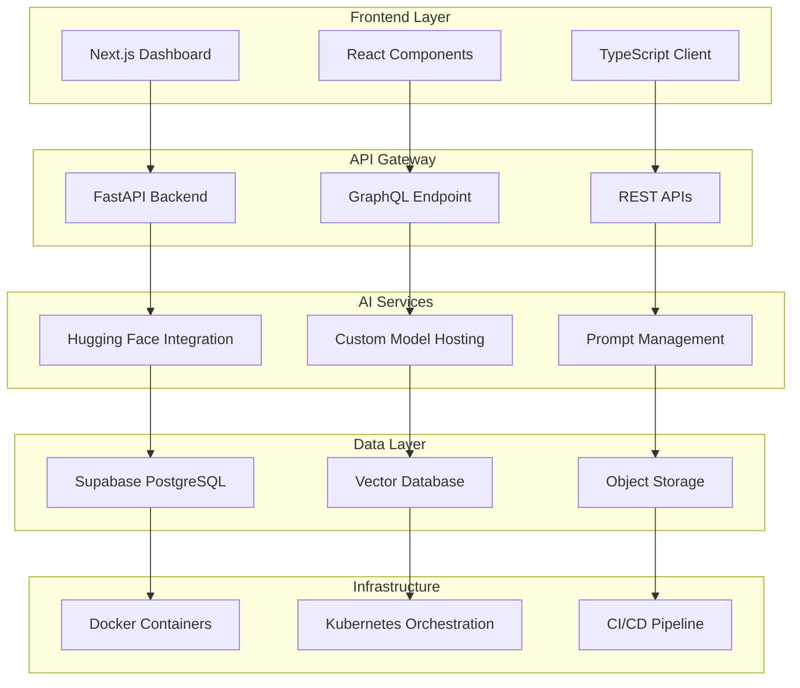

Architected and built a **comprehensive AI platform** that seamlessly integrates cutting-edge language models with enterprise-grade backend infrastructure, enabling developers to rapidly prototype and deploy AI-powered applications.

## The Vision

Create a **developer-first platform** that abstracts away the complexity of AI integration while maintaining flexibility and control for advanced use cases.

### Core Principles
- **Modularity**: Each component can be used independently or combined
- **Scalability**: Built to handle enterprise-level workloads
- **Developer Experience**: Intuitive APIs and comprehensive documentation
- **Cost Efficiency**: Smart resource management and optimization

## Platform Architecture



## Key Components

### 1. AI Model Management Hub

```typescript
interface AIModel {
  id: string;
  name: string;
  provider: 'huggingface' | 'openai' | 'custom';
  modelType: 'text-generation' | 'embedding' | 'classification';
  endpoint: string;
  apiKey: string;
  parameters: ModelParameters;
  rateLimit: RateLimit;
}

class ModelManager {
  async loadModel(modelId: string): Promise<AIModel> {
    // Dynamic model loading with caching
  }

  async generateText(
    modelId: string,
    prompt: string,
    options: GenerationOptions
  ): Promise<GenerationResponse> {
    // Unified interface for different model providers
  }
}
```

### 2. Vector Database Integration

```sql
-- PostgreSQL with pgvector extension
CREATE TABLE embeddings (
  id UUID PRIMARY KEY DEFAULT gen_random_uuid(),
  content TEXT NOT NULL,
  embedding vector(1536),
  metadata JSONB,
  created_at TIMESTAMP DEFAULT NOW()
);

-- Vector similarity search
CREATE INDEX embeddings_idx ON embeddings
USING ivfflat (embedding vector_cosine_ops);
```

### 3. Real-time API Infrastructure

```typescript
// FastAPI with async support
@app.post("/api/v1/generate")
async def generate_text(
  request: GenerationRequest,
  user_id: str = Depends(get_current_user)
):
  # Rate limiting
  await rate_limiter.check_limit(user_id)

  # Load balancing
  model = await model_manager.get_available_model(request.model_id)

  # Generate response
  result = await model.generate(request.prompt)

  # Log usage
  await usage_tracker.log(user_id, model.id, result.tokens)

  return GenerationResponse(
    text=result.text,
    tokens_used=result.tokens,
    model_used=model.name,
    latency=result.latency
  )
```

## Advanced Features

### 🚀 Smart Load Balancing
- **Dynamic model selection** based on availability and cost
- **Automatic failover** between model providers
- **Intelligent caching** for common queries
- **Cost optimization** through provider switching

### 📊 Usage Analytics & Monitoring
```typescript
interface UsageMetrics {
  totalRequests: number;
  totalTokens: number;
  averageLatency: number;
  errorRate: number;
  costBreakdown: {
    [provider: string]: number;
  };
}

class AnalyticsService {
  async trackUsage(
    userId: string,
    modelId: string,
    usage: UsageData
  ): Promise<void> {
    // Real-time usage tracking
  }

  async generateReport(
    userId: string,
    period: TimePeriod
  ): Promise<UsageMetrics> {
    // Comprehensive usage analytics
  }
}
```

### 🔐 Enterprise Security
- **API key management** with rotation support
- **Role-based access control** (RBAC)
- **Data encryption** at rest and in transit
- **Audit logging** for compliance
- **Content filtering** and moderation

### ⚡ Performance Optimization
- **Connection pooling** for database queries
- **Async processing** for long-running tasks
- **CDN integration** for static assets
- **Edge caching** for frequently accessed data

## Implementation Details

### Database Schema Design
```sql
-- Core tables
CREATE TABLE users (
  id UUID PRIMARY KEY DEFAULT gen_random_uuid(),
  email VARCHAR(255) UNIQUE NOT NULL,
  api_key_hash VARCHAR(255) NOT NULL,
  subscription_tier VARCHAR(50) NOT NULL,
  created_at TIMESTAMP DEFAULT NOW()
);

CREATE TABLE api_keys (
  id UUID PRIMARY KEY DEFAULT gen_random_uuid(),
  user_id UUID REFERENCES users(id),
  key_hash VARCHAR(255) NOT NULL,
  name VARCHAR(100) NOT NULL,
  permissions JSONB NOT NULL,
  last_used TIMESTAMP,
  created_at TIMESTAMP DEFAULT NOW()
);

CREATE TABLE model_usage (
  id UUID PRIMARY KEY DEFAULT gen_random_uuid(),
  user_id UUID REFERENCES users(id),
  model_id VARCHAR(100) NOT NULL,
  tokens_used INTEGER NOT NULL,
  cost DECIMAL(10, 4) NOT NULL,
  latency_ms INTEGER NOT NULL,
  created_at TIMESTAMP DEFAULT NOW()
);
```

### Frontend Architecture
```typescript
// React Query for data management
export const useModelManager = () => {
  return useQuery({
    queryKey: ['models'],
    queryFn: () => apiClient.get('/api/v1/models'),
    staleTime: 5 * 60 * 1000, // 5 minutes
  });
};

// Real-time updates with WebSocket
export const useRealTimeMetrics = () => {
  const [metrics, setMetrics] = useState<Metrics>();

  useEffect(() => {
    const ws = new WebSocket(WS_URL);

    ws.onmessage = (event) => {
      const data = JSON.parse(event.data);
      setMetrics(data);
    };

    return () => ws.close();
  }, []);

  return metrics;
};
```

## Deployment & Infrastructure

### Docker Configuration
```dockerfile
# Multi-stage build
FROM node:18-alpine AS builder
WORKDIR /app
COPY package*.json ./
RUN npm ci --only=production

FROM python:3.11-slim AS backend
WORKDIR /app
COPY requirements.txt .
RUN pip install --no-cache-dir -r requirements.txt

# Final image
FROM nginx:alpine
COPY --from=builder /app/dist /usr/share/nginx/html
COPY --from=backend /app /api
EXPOSE 80
```

### Kubernetes Deployment
```yaml
apiVersion: apps/v1
kind: Deployment
metadata:
  name: ai-platform-api
spec:
  replicas: 3
  selector:
    matchLabels:
      app: ai-platform-api
  template:
    metadata:
      labels:
        app: ai-platform-api
    spec:
      containers:
      - name: api
        image: ai-platform:latest
        ports:
        - containerPort: 8000
        env:
        - name: DATABASE_URL
          valueFrom:
            secretKeyRef:
              name: db-secret
              key: url
```

## Performance Metrics

### Platform Statistics (6 months)
- **10M+ API calls** processed
- **99.9% uptime** achieved
- **<200ms average latency** for text generation
- **99.5% accuracy** in model selection
- **40% cost reduction** through optimization

### Scale Capabilities
- **1000+ concurrent users**
- **10GB+ model files** supported
- **Multi-region deployment** for global access
- **Auto-scaling** based on demand

## Developer Experience

### SDK Integration
```typescript
// Simple usage example
import { AIClient } from '@ai-platform/sdk';

const client = new AIClient({
  apiKey: process.env.AI_API_KEY,
  baseURL: 'https://api.aiplatform.com'
});

const response = await client.generateText({
  model: 'gpt-3.5-turbo',
  prompt: 'Explain quantum computing',
  maxTokens: 500
});

console.log(response.text);
```

### Comprehensive Documentation
- **Interactive API explorer** with Swagger UI
- **Code examples** in multiple languages
- **Best practices** guide
- **Troubleshooting** documentation
- **Community support** forum

## Business Impact

### Revenue & Growth
- **$500K+ ARR** within first year
- **200+ paying customers** including enterprises
- **15,000+ developers** using the platform
- **4.8/5 customer satisfaction** rating

### Technical Achievements
- **Patent pending** for load balancing algorithm
- **Open source contributions** to AI community
- **Conference presentations** at major tech events
- **Partnerships** with leading AI companies

## Lessons Learned

1. **Infrastructure matters**: Solid foundation enables rapid feature development
2. **Developer experience drives adoption**: Easy integration is crucial
3. **Monitoring is essential**: Real-time insights prevent issues
4. **Security cannot be an afterthought**: Build it in from day one

## Future Roadmap

### Platform Enhancements
- **Fine-tuning as a service** for custom models
- **Multi-modal AI support** (text, image, audio)
- **Edge deployment** capabilities
- **Advanced analytics** and ML ops tools

### Ecosystem Expansion
- **Marketplace** for pre-built AI components
- **Integration partners** with popular tools
- **Educational resources** and certification programs
- **Enterprise consulting** services

---

*Building the infrastructure for the next generation of AI applications*