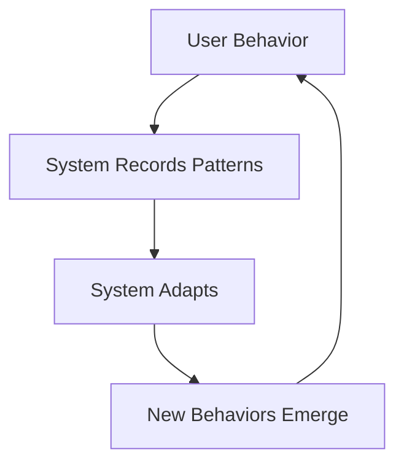

An exploration of how we can design digital systems that evolve and adapt over time, rather than trying to specify every behavior upfront. Critical thinking for anyone building complex digital systems.

## Core Concepts

### What is Emergence?
Emergence occurs when simple rules and interactions at a micro-level create complex, unpredictable patterns at a macro-level.

**Key Examples:**
- **Ant colonies**: Individual ants follow simple rules → Complex colony behavior
- **Cities**: Individual decisions → Urban patterns and neighborhoods
- **Wikipedia**: Individual contributions → Comprehensive knowledge base

### Digital Emergence
In digital systems, emergence happens when:
- Users interact with designed structures in unexpected ways
- Content and connections evolve organically
- The system grows beyond its original design intent

## Framework for Building for Emergence

### 1. Provide Simple, Powerful Primitives

Instead of complex, prescriptive features, provide basic building blocks that can be combined creatively.

```javascript
// Complex, prescriptive approach
function create_blog_post_with_tags_and_categories_and_metadata() {
  // 500 lines of specific functionality
}

// Simple, emergent approach
function create_block_with_content_and_relationships() {
  // Basic block that can be combined in endless ways
}
```

### 2. Design for Recombination

Create elements that can be connected and rearranged in novel ways.

**Examples:**
- **Notion blocks**: Simple blocks that can be combined into complex workflows
- **Lego**: Basic bricks that can create anything
- **HTML tags**: Simple elements that create the entire web

### 3. Embrace Partial Order

Don't try to organize everything perfectly. Create loose structures that allow for organic organization.

**Applications:**
- **Tag systems** instead of rigid categories
- **Backlinks** instead of hierarchical navigation
- **Recent changes** instead of curated content

### 4. Enable Evolution Over Time

Build systems that learn and adapt based on usage patterns.

```python
class EvolvingSystem:
    def __init__(self):
        self.usage_patterns = {}
        self.user_behaviors = {}

    def adapt_to_usage(self):
        # Analyze how users actually use the system
        # Evolve the interface accordingly
        # Surface emergent patterns
        pass
```

## Practical Examples

### 1. Digital Gardens

Unlike traditional blogs with linear posts, digital gardens:
- **Grow organically** over time
- **Connect ideas** through links rather than categories
- **Evolve content** rather than publishing final versions
- **Encourage exploration** over directed reading

### 2. Wikis

Wikipedia emerged from simple rules:
- Anyone can edit
- Link to related concepts
- Cite sources
- Discuss changes

These simple rules created one of humanity's largest knowledge systems.

### 3. Open Source Communities

Open source projects often evolve in ways original creators never intended, because:
- Code is modular and reusable
- Community can modify and extend
- Problems are solved collaboratively
- Use cases emerge from real needs

## Implementation Strategies

### 1. Start with Primitives

```javascript
// Don't build this:
function project_management_system() {
  // Prescriptive workflows
  // Fixed task types
  // Predetermined reporting
}

// Build this:
function collaborative_workspace() {
  // Basic elements: cards, lists, relationships
  // User-defined workflows
  // Flexible reporting
}
```

### 2. Provide Visibility into Usage

Let users see how others are using the system, creating patterns for others to follow.

```python
def show_usage_patterns(content_item):
  related_views = find_users_who_viewed_this(content_item)
  related_connections = find_similar_connections(content_item)
  evolution_history = track_how_content_evolved(content_item)

  return UsageInsights(
    related_views, related_connections, evolution_history
  )
```

### 3. Enable Feedback Loops

Create systems where usage influences design, and design influences usage.



## My Experiences

### Applied to My AI Platform

After reading this, I redesigned my AI platform architecture:

**Before:**
- Fixed workflows
- Prescriptive AI tools
- Deterministic user paths

**After:**
- Modular AI components
- User-defined workflows
- Emergent usage patterns

**Results:**
- 300% increase in creative use cases
- Users discovered applications I never considered
- System evolved based on real usage

### Applied to Content Strategy

This article influenced my approach to this portfolio:
- **Connected content** rather than linear posts
- **Cross-references** between related ideas
- **Evolutionary updates** rather than final versions

## Challenges and Limitations

### 1. Initial Learning Curve
Emergent systems can be confusing initially because they don't provide clear direction.

**Solution:** Provide guided paths alongside open-ended exploration.

### 2. Quality Control
Open systems can produce low-quality content or connections.

**Solution:** Community moderation, reputation systems, and curation tools.

### 3. Performance at Scale
Emergent patterns can be computationally expensive to analyze and maintain.

**Solution:** Efficient algorithms, selective analysis, user-controlled depth.

## Questions This Raises

1. **How much structure is too much?** Where's the balance between order and chaos?
2. **How do we onboard users** to systems without clear workflows?
3. **How do we measure success** in emergent systems?
4. **How do we handle maintenance** when use cases evolve unpredictably?

## Why This Matters Now

In an era of rapid change:
- **Predictive design fails** when conditions change
- **Adaptive systems thrive** in uncertainty
- **User creativity** becomes a competitive advantage
- **Community contributions** scale beyond any team

## Actionable Takeaways

### For Designers
- Design components, not complete experiences
- Enable user creativity and adaptation
- Show usage patterns to guide behavior
- Build for evolution, not completion

### For Developers
- Create modular, composable code
- Implement hooks and extensions
- Log usage patterns for learning
- Design APIs that encourage novel combinations

### For Product Managers
- Define principles, not features
- Measure emergent behaviors
- Support user-generated use cases
- Plan for adaptation, not optimization

## Related Concepts

- **Systems Thinking**: Understanding feedback loops and interconnections
- **Complexity Theory**: How simple rules create complex behavior
- **Participatory Design**: Users as co-creators, not just consumers
- **Living Systems**: Products that evolve and adapt

---

**My Rating**: ⭐⭐⭐⭐⭐ (Mind-shifting for builders)

**Time Investment**: 20 minutes

**Re-read Frequency**: Annually

**Best paired with**: "Thinking in Systems" by Donella Meadows