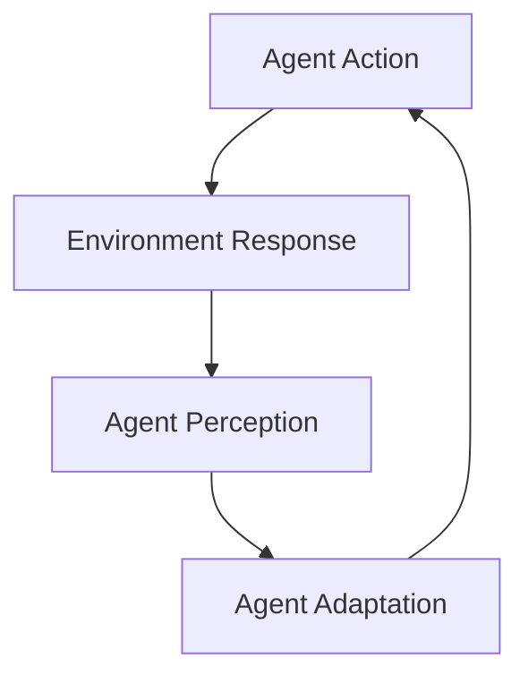

Explores how complex, adaptive behaviors emerge from simple rules and interactions. Fundamental for understanding both natural and artificial systems.

## The Core Thesis

**Emergence** happens when simple components follow simple rules, creating complex collective behavior that's not present in any individual component.

**Key insight:** We don't need to design complex systems—we need to design simple systems that can become complex.

## Examples of Emergence

### Natural Systems

1. **Ant Colonies**: Simple rules (follow pheromones, grab food) → Complex foraging patterns
2. **Flocking Birds**: Simple alignment rules → Beautiful coordinated movement
3. **Cities**: Individual choices → Neighborhoods, traffic patterns, culture

### Digital Systems

1. **Internet**: Simple protocols → Global information network
2. **Bitcoin**: Simple consensus rules → Financial ecosystem
3. **Wikipedia**: Simple editing rules → Comprehensive encyclopedia

## Principles for Designing for Emergence

### 1. Simple Rules, Complex Outcomes

Don't specify behaviors—specify rules that generate behaviors.

```javascript
// Don't do this: Complex traffic management
function manage_traffic():
  if (cars_count > 100 && time == "rush_hour"):
    // 500 lines of complex traffic logic
  // ... hundreds more conditions

// Do this: Simple rules
function simple_traffic_rules():
  cars.follow_distance = 2_seconds
  lights.cycle_time = adapt_to_traffic()
  drivers.choose_fastest_route()
```

### 2. Distributed Intelligence

Put intelligence in the components, not the central controller.

```python
# Centralized approach
def central_scheduler():
  # Tell everyone what to do
  for agent in all_agents:
    agent.task = calculate_optimal_task(agent)

# Distributed approach
def distributed_system():
  # Agents decide for themselves based on local information
  for agent in agents:
    agent.choose_task_based_on_local_context()
```

### 3. Feedback Loops

Create systems where outputs influence inputs.



### 4. Scalable Interactions

Design interactions that work at any scale.

```python
def scalable_interaction(agent1, agent2):
  # Works whether there are 2 agents or 2 million
  return interact_based_on_local_rules(agent1, agent2)
```

## Applications to Technology

### 1. Software Architecture

**Monolithic Design:**
- Centralized control
- Rigid structure
- Hard to modify

**Emergent Design:**
- Distributed components
- Flexible connections
- Self-organizing

### 2. User Interfaces

**Traditional UI:**
- Prescribed workflows
- Fixed navigation
- Designer-determined paths

**Emergent UI:**
- User-defined workflows
- Adaptive navigation
- Emergent usage patterns

### 3. Network Protocols

**The Internet** is the ultimate example:
- Simple TCP/IP rules
- No central control
- Emergent global behavior
- Constantly evolving

## My Projects and Emergent Design

### AI Platform Architecture

This thinking influenced my platform design:

**Before (Monolithic):**
```python
class AIPlatform:
    def process_request(self, request):
        # Centralized processing
        # Fixed workflow
        # Limited flexibility
```

**After (Emergent):**
```python
class EcosystemAI:
    def __init__(self):
        self.agents = []
        self.rules = interaction_rules()

    def process_request(self, request):
        # Agents self-organize to handle request
        # Workflows emerge from interactions
        # System adapts to patterns
```

### RAG System Design

**Traditional:** Fixed retrieval → generation pipeline
**Emergent:** Components self-organize based on query type

## Implementation Guidelines

### 1. Define Rules, Not Behaviors

```python
# Bad: Specify behavior
def handle_customer_request():
    if request.type == "complaint":
        follow_complaint_script()
    elif request.type == "question":
        follow_question_script()

# Good: Define rules
def customer_interaction_rules():
    agents.be_helpful()
    agents.respond_quickly()
    agents.learn_from_feedback()
    agents.escalate_when_needed()
```

### 2. Enable Local Decision-Making

```python
class EmergentAgent:
    def act(self, local_context):
        # Make decisions based on local information
        # Don't wait for central instructions
        return self.calculate_best_action(local_context)
```

### 3. Provide Feedback Mechanisms

```python
class FeedbackSystem:
    def provide_feedback(self, action, outcome):
        # Agents learn from results
        # System adapts to patterns
        # Rules evolve based on effectiveness
```

## Measuring Emergence

### Indicators of Emergent Behavior

1. **Novel Patterns**: Unexpected regularities appear
2. **Self-Organization**: Order emerges without central control
3. **Adaptation**: System responds to environmental changes
4. **Scalability**: Behavior works at different scales

### Metrics to Track

```python
def measure_emergence(system):
    return {
        "pattern_diversity": count_unique_patterns(system),
        "adaptation_speed": measure_responsiveness(system),
        "scalability_factor": test_different_scales(system),
        "novelty_generation": count_new_behaviors(system)
    }
```

## Challenges and Solutions

### Challenge 1: Unpredictability
**Problem:** Emergent systems can behave in unexpected ways
**Solution:** Build in constraints and fail-safes

### Challenge 2: Initial Chaos
**Problem:** Early stages can be disorganized
**Solution:** Provide initial conditions and guiding patterns

### Challenge 3: Optimization Difficulty
**Problem:** Hard to optimize emergent systems
**Solution:** Focus on rule optimization, not outcome optimization

## Modern Examples

### 1. Social Networks
Simple rules (connect, share, like) → Complex social dynamics

### 2. Marketplaces
Simple rules (list, bid, transact) → Complex economic behavior

### 3. Open Source
Simple rules (contribute, merge, maintain) → Complex software ecosystems

## Future Implications

### AI and Emergence
- **Swarm Intelligence**: Multiple AI agents collaborating
- **Self-Improving Systems**: AI that modifies its own rules
- **Distributed Learning**: Knowledge emerges across systems

### Technology Evolution
- **Adaptive Architecture**: Buildings that respond to usage
- **Smart Cities**: Traffic, energy, services self-organizing
- **Internet of Things**: Devices creating emergent behaviors

## Questions to Consider

1. **How much control is too much?** When do rules become constraints?
2. **How do we debug emergent systems?** How to fix problems without breaking emergence?
3. **How do we ensure safety?** How to prevent harmful emergent behaviors?
4. **How do we measure success?** What metrics matter for emergent systems?

## Practical Exercises

### 1. Rule Simplification
Take a complex system and identify the minimum rules needed for emergence.

### 2. Pattern Spotting
Look for emergent patterns in existing systems (natural or digital).

### 3. Distributed Design
Redesign a centralized system to use distributed intelligence.

## Related Reading

- **"Emergence: The Connected Lives of Ants, Brains, Cities"** by Steven Johnson
- **"Complexity: A Guided Tour"** by Melanie Mitchell
- **"The Nature of Code"** by Daniel Shiffman

---

**My Rating**: ⭐⭐⭐⭐ (Inspiring but needs practical grounding)

**Time Investment**: 25 minutes

**Re-read Frequency:** Every 18 months

**Best for:** Systems designers, architects, product managers